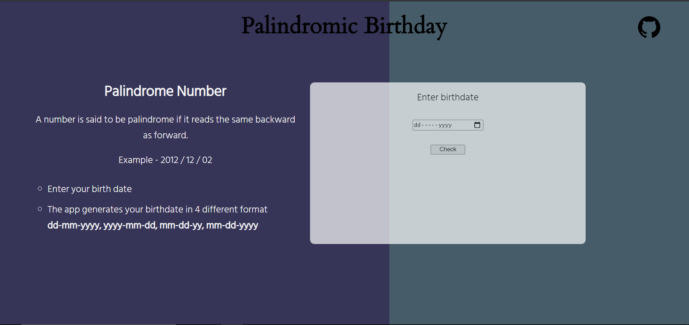
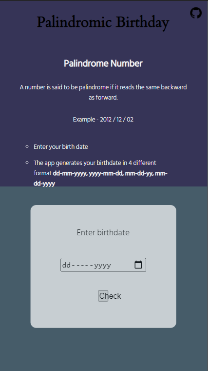

# Palindrome Birthday 🎂

## ✨ About 

Enter your birthdate and see if your birthdate is a palindrome or not.

-> Takes input of birthdate from user.    
-> Checks if a date is Palindrome.  
-> Display result.  

## 😉 **Glimpses**

&nbsp; &nbsp; &nbsp; &nbsp; 

## 👉 Check here [Live](https://dcs-palindrome-birthday.netlify.app/)

## 💻 **Built with**

 &nbsp;  &nbsp;   &nbsp;  

